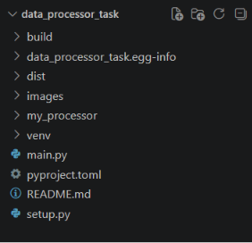
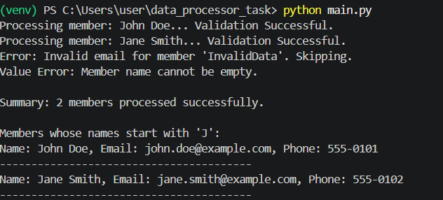

# Member Data Management System

## Overview
The Member Data Management System is a Python application developed as part of the Core Python Concepts Assignment. The project processes raw member data, validates email addresses and phone numbers using Regular Expressions, handles exceptions, and demonstrates Object-Oriented Programming, Functional Programming, and Python Packaging.

## Features
- Stores member information using Lists and Dictionaries.
- Cleans raw member data.
- Validates email addresses using Regular Expressions.
- Validates phone numbers using Regular Expressions.
- Uses a custom exception (`InvalidMemberDataError`).
- Handles standard exceptions using `ValueError`.
- Demonstrates Object-Oriented Programming through the `Member` class.
- Uses `lambda` and `filter()` for functional programming.
- Packaged as an installable Python Wheel (`.whl`).

## Project Structure

```text
data_processor_task/
│
├── main.py
├── README.md
├── setup.py
├── pyproject.toml
│
├── my_processor/
│   ├── __init__.py
│   ├── core.py
│   ├── utils.py
│   └── exceptions.py
│
├── dist/
└── venv/
```



## Requirements

- Python 3.8 or above
- setuptools
- wheel

## Create Virtual Environment

```bash
python -m venv venv
```

## Activate Virtual Environment (Windows)

```bash
.\venv\Scripts\Activate
```

## Install Required Packages

```bash
python -m pip install --upgrade pip setuptools wheel
```


## Run the Project

```bash
python main.py
```

## Build the Wheel File

```bash
python setup.py sdist bdist_wheel
```

The generated wheel file will be available inside the `dist` folder.

## Install the Wheel File

```bash
pip install dist\data_processor_task-1.0.0-py3-none-any.whl
```

## Sample Output

```text
Processing member: John Doe... Validation Successful.
Processing member: Jane Smith... Validation Successful.
Error: Invalid email for member 'InvalidData'. Skipping.
Value Error: Member name cannot be empty.

Summary: 2 members processed successfully.

Members whose names start with 'J':

Name: John Doe, Email: john.doe@example.com, Phone: 555-0101
----------------------------------------

Name: Jane Smith, Email: jane.smith@example.com, Phone: 555-0102
----------------------------------------
```



## Technologies Used

- Python
- Object-Oriented Programming (OOP)
- Regular Expressions (Regex)
- Exception Handling
- Functional Programming
- Python Packaging (setuptools)

## Author

**Palak Meena**

