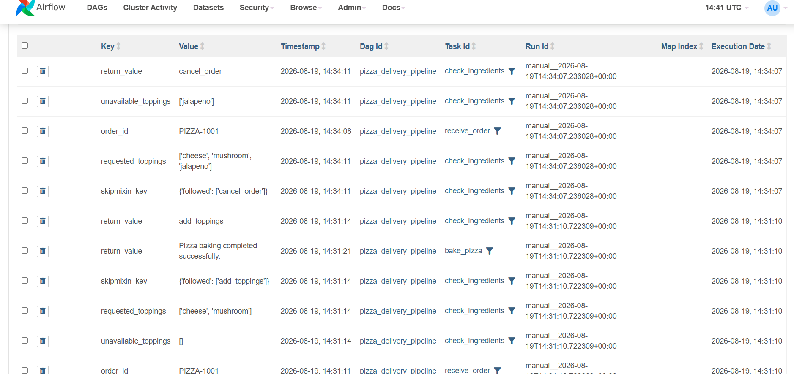
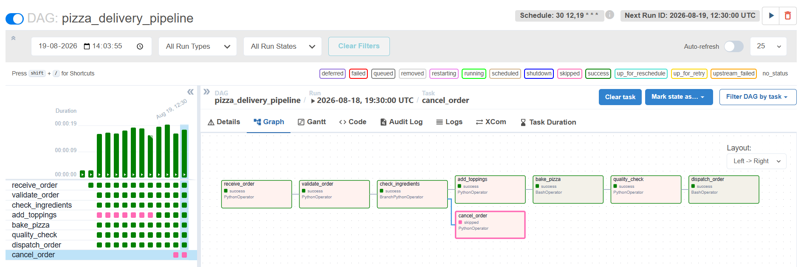
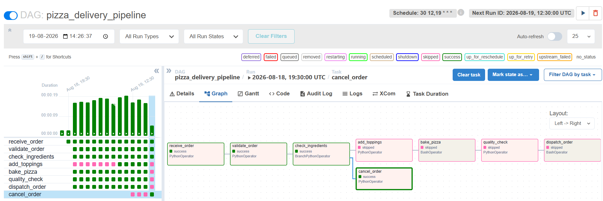
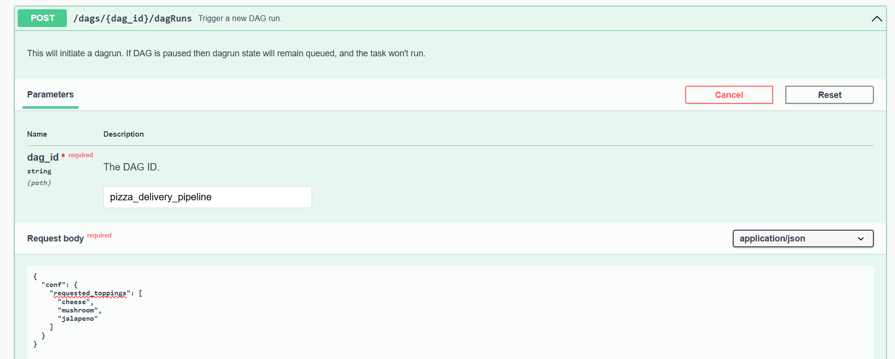
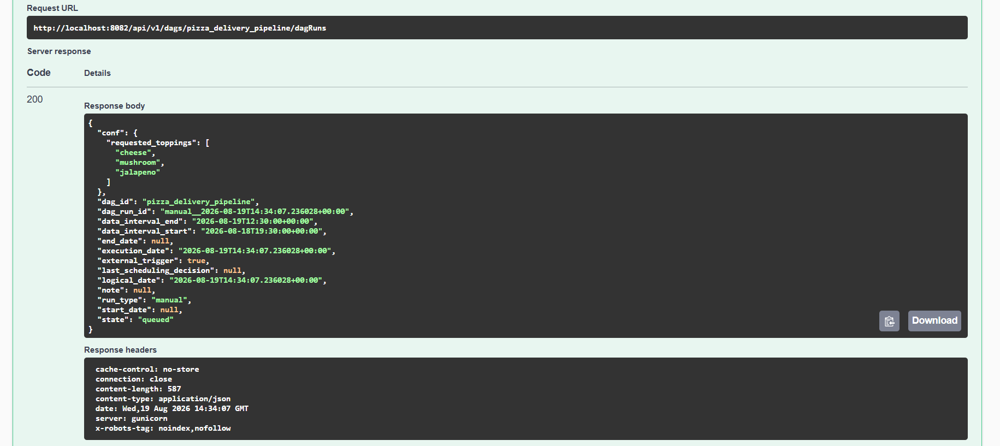
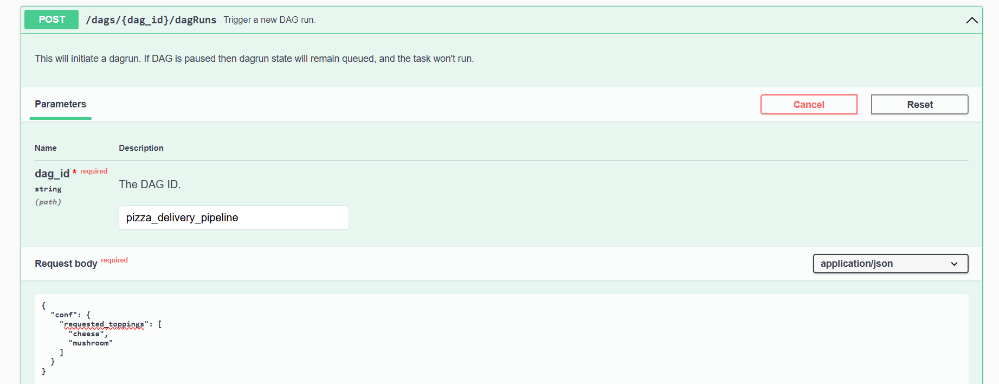
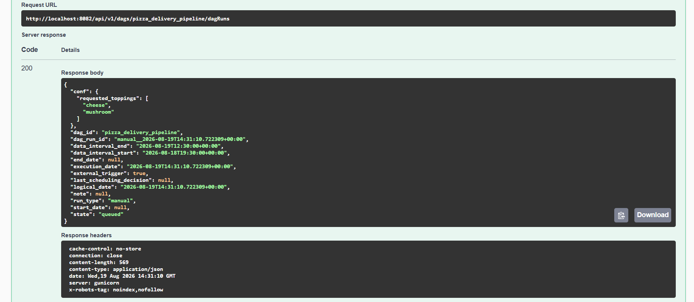

## The Pizza Delivery Pipeline - Apache Airflow

An automated pizza order-to-delivery workflow built with **Apache Airflow**.

The DAG receives an order, validates it, checks ingredient availability, and
then decides whether the pizza should continue through preparation and
delivery or be canceled.

---

## Workflow

The pipeline contains **8 tasks**:

```text
receive_order
      ↓
validate_order
      ↓
check_ingredients
      │
      ├──────────────→ cancel_order
      │
      ↓
add_toppings
      ↓
bake_pizza
      ↓
quality_check
      ↓
dispatch_order
```

### Task Flow

- **`receive_order`** — Receives the order and generates an order ID.
- **`validate_order`** — Validates the order using information passed through
  XCom.
- **`check_ingredients`** — Checks the requested toppings and decides which
  branch should run.
- **`add_toppings`** — Adds toppings when all requested ingredients are
  available.
- **`bake_pizza`** — Simulates baking using `BashOperator`.
- **`quality_check`** — Performs the final pizza quality check.
- **`dispatch_order`** — Simulates dispatching the pizza using
  `BashOperator`.
- **`cancel_order`** — Cancels the order when a requested topping is
  unavailable.

---


### All Ingredients Available

If all requested toppings are available:

```text
check_ingredients
       ↓
add_toppings
       ↓
bake_pizza
       ↓
quality_check
       ↓
dispatch_order
```

The `cancel_order` task is automatically **skipped**.

```text
add_toppings       → SUCCESS
bake_pizza         → SUCCESS
quality_check      → SUCCESS
dispatch_order     → SUCCESS
cancel_order       → SKIPPED
```

###  Ingredient Unavailable

If any requested topping is unavailable:

```text
check_ingredients
       ↓
cancel_order
```

The pizza-production branch is automatically skipped.

```text
add_toppings       → SKIPPED
bake_pizza         → SKIPPED
quality_check      → SKIPPED
dispatch_order     → SKIPPED
cancel_order       → SUCCESS
```


---

## XCom

**XCom** is used to pass runtime information between tasks.

`receive_order` generates an order ID and stores it in XCom.

For example:

```text
PIZZA-1001
```



---


## Logging

Every task uses the **Airflow task logger** to produce meaningful logs.

The logs record:

- Order ID
- Requested toppings
- Available and unavailable toppings
- Branching decisions
- Baking status
- Quality-check results
- Dispatch status
- Cancellation reason

This makes each DAG run easy to understand and troubleshoot.

---

## Schedule

The DAG runs at:

```text
30 12,19 * * *
```

This represents the two main pizza-shop rush periods:

- **12:30 PM — Lunch Rush**
- **7:30 PM — Dinner Rush**

The DAG uses `catchup=False` so that old scheduled runs are not created when
the DAG is deployed.

---

##  REST API Testing

The DAG was triggered using the **Airflow REST API through Swagger**.

Two scenarios were tested.

### Test 1 - Available Toppings

### Successful Pizza Delivery

All requested toppings are available and the pizza reaches dispatch.



### Unavailable Topping

The requested topping is unavailable, so the order is canceled and the
remaining production tasks are skipped.



### Swagger API - Unavailable Toppings




### Swagger API - Available Topping




---

## Project Structure

```text
airflow_505/
│
├── dags/
│   └── pizza_delivery_dag.py
│
├── screenshots/
│   ├── successful_run.png
│   ├── canceled_run.png
│   ├── swagger_available.png
│   └── swagger_unavailable.png
│
├── docker-compose.yaml
└── airflow.cfg
```

---


## Conclusion

The Pizza Delivery Pipeline demonstrates how Apache Airflow can automate a
real-world workflow and make decisions based on runtime conditions.

When all toppings are available, the order follows the complete
pizza-production and delivery path.

When a requested topping is unavailable, Airflow automatically follows the
cancellation branch and skips the remaining production tasks.


